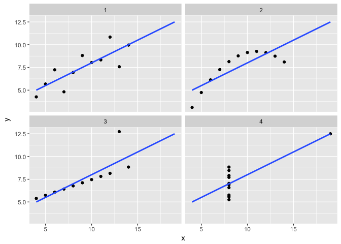
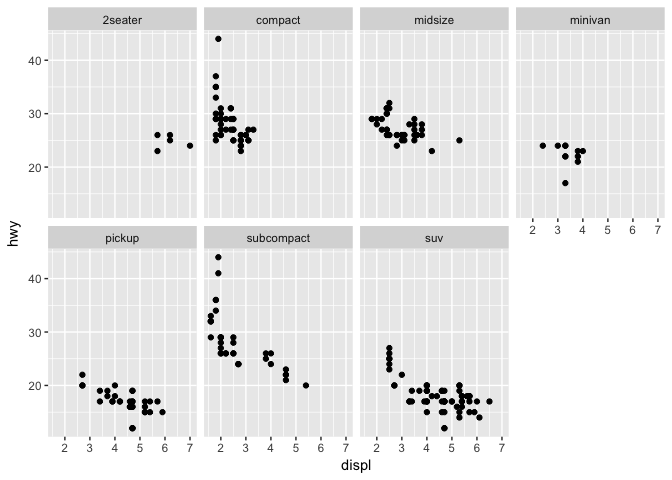
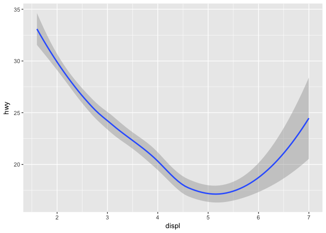

Introduction to Tidyverse for Data Science
================
Jason Liu and Clayton Halim
9/5/2017

R Markdown
----------

This is an R Markdown document. Markdown is a simple formatting syntax for authoring HTML, PDF, and MS Word documents. For more details on using R Markdown see <http://rmarkdown.rstudio.com>.

When you click the **Knit** button a document will be generated that includes both content as well as the output of any embedded R code chunks within the document. You can embed an R code chunk like this:

``` r
summary(cars)
```

    ##      speed           dist       
    ##  Min.   : 4.0   Min.   :  2.00  
    ##  1st Qu.:12.0   1st Qu.: 26.00  
    ##  Median :15.0   Median : 36.00  
    ##  Mean   :15.4   Mean   : 42.98  
    ##  3rd Qu.:19.0   3rd Qu.: 56.00  
    ##  Max.   :25.0   Max.   :120.00

Including Plots
---------------

You can also embed plots, for example:


Note that the `echo = FALSE` parameter was added to the code chunk to prevent printing of the R code that generated the plot.

The efficient data scientist.
=============================

I'm going to try to keep the buzzword density low here.

Data science, oversimplified, can be though of as two classes of work, **Algorithms** and **Analytics**. While analytics may not be doing algorithm design or complex modeling, those who are implementing these algorithms on real data often find themselves to analyzing data. They need to understand the biases their models have and confirm that the data is approporiate for the model.

What is the difference?
-----------------------

From my own perspective...

**Analytics:** Studying the business's data and making recommendations, understanding experiments to improve operations and product. This type of data science is about transforming businesses using insights.

**Algorithms:** Using machine learning and statistics to build tools. Here, the service or model is the product.

Even within the realm of algorithms and machine learning, to make best models, we need to understand the requirements of the data for models to succeed and to confirm these models. For example, take the Anscombe's Quartet.

It turns out that the quantiles, correlation, r squared of a linear model on these data are all the same. This is a common pitfall that occur when we try modeling without... practising safe statistics.



The Standard. Tidy Data.
========================

> Happy families are all alike; every unhappy family is unhappy in its own way.

Tidy data is a standard way of mapping the meaning of a dataset to its structure. A dataset is messy or tidy depending on how rows, columns and tables are matched up with observations, variables and types. In tidy data:

1.  Each variable forms a column.
2.  Each observation forms a row.
3.  Each type of observational unit forms a table.
4.  A single observational unit is stored in multiple tables.

Tidy data makes it easy for an analyst or a computer to extract needed variables because it provides a standard way of structuring a dataset

The five most common problems with messy datasets, along with their remedies:

1.  Column headers are values, not variable names.
2.  Multiple variables are stored in one column.
3.  Variables are stored in both rows and columns.
4.  Multiple types of observational units are stored in the same table.

The text above came from <http://www.jstatsoft.org/v59/i10/paper>, the original tidy data paper.

The value will become more and more apparent when doing transformations and visualizations on datasets that are more complex.

tidyr::gather
-------------

``` r
table4b
```

    ## # A tibble: 3 x 3
    ##       country     `1999`     `2000`
    ## *       <chr>      <int>      <int>
    ## 1 Afghanistan   19987071   20595360
    ## 2      Brazil  172006362  174504898
    ## 3       China 1272915272 1280428583

Notice that the in this table the column names are the years and the variable that represents the values are unclear. We can use the `tidyr::gather` command to reshape and tidy the data.

``` r
table4b %>% 
  gather(year, population, 2:3)
```

    ## # A tibble: 6 x 3
    ##       country  year population
    ##         <chr> <chr>      <int>
    ## 1 Afghanistan  1999   19987071
    ## 2      Brazil  1999  172006362
    ## 3       China  1999 1272915272
    ## 4 Afghanistan  2000   20595360
    ## 5      Brazil  2000  174504898
    ## 6       China  2000 1280428583

tidyr::spread
-------------

The opposite of gather is spread, which is often helpful for human readability.

``` r
table2
```

    ## # A tibble: 12 x 4
    ##        country  year       type      count
    ##          <chr> <int>      <chr>      <int>
    ##  1 Afghanistan  1999      cases        745
    ##  2 Afghanistan  1999 population   19987071
    ##  3 Afghanistan  2000      cases       2666
    ##  4 Afghanistan  2000 population   20595360
    ##  5      Brazil  1999      cases      37737
    ##  6      Brazil  1999 population  172006362
    ##  7      Brazil  2000      cases      80488
    ##  8      Brazil  2000 population  174504898
    ##  9       China  1999      cases     212258
    ## 10       China  1999 population 1272915272
    ## 11       China  2000      cases     213766
    ## 12       China  2000 population 1280428583

Here we just need to pass in the column name that will be converted into rows and the value.

``` r
table2 %>% 
  spread(type, count)
```

    ## # A tibble: 6 x 4
    ##       country  year  cases population
    ## *       <chr> <int>  <int>      <int>
    ## 1 Afghanistan  1999    745   19987071
    ## 2 Afghanistan  2000   2666   20595360
    ## 3      Brazil  1999  37737  172006362
    ## 4      Brazil  2000  80488  174504898
    ## 5       China  1999 212258 1272915272
    ## 6       China  2000 213766 1280428583

This would be usefull if we want to compute a new value such as `rate=cases/population`.

tidyr::unite, tidyr::seperate
-----------------------------

There are also functions called `unite` and `seperate` that I encourage you to learn these on your own. Try `??seperate` in the command line. These will split one column into many columns and vise versa.

These functions are useful for cases when one column contains many variables, for example when a column has values such as `male_treatmenta` we might want to seperate this value on `_` and transform into a `gender` and `treatment_type` columns.

Data Transformation
===================

Data transformation is a process useful for converting one data format to another. You will later see things like filtering data based on the required conditions, creating new columns, etc.

Source: [dplyr tutorial](http://genomicsclass.github.io/book/pages/dplyr_tutorial.html)

What is dplyr?
--------------

dplyr is a powerful R-package to transform and summarize tabular data with rows and columns.

Why is it useful?
-----------------

The package contains a set of functions (or “verbs”) that perform common data manipulation operations such as filtering for rows, selecting specific columns, re-ordering rows, adding new columns and summarizing data.

In addition, dplyr contains a useful function to perform another common task which is the “split-apply-combine” concept. We will discuss that in a little bit.

Important dplyr verbs to remember
---------------------------------

-   `select()`: select columns
-   `filter()`: filter rows
-   `arrange()`: re-order or arrange rows
-   `mutate()`: create new columns
-   `summarise()`: summarise values
-   `group_by()`: allows for group operations in the “split-apply-combine” concept

Dataset: Cars (mpg)
-------------------

Quick look at the first 5 entires in the data

``` r
head(mpg)
```

    ## # A tibble: 6 x 11
    ##   manufacturer model displ  year   cyl      trans   drv   cty   hwy    fl
    ##          <chr> <chr> <dbl> <int> <int>      <chr> <chr> <int> <int> <chr>
    ## 1         audi    a4   1.8  1999     4   auto(l5)     f    18    29     p
    ## 2         audi    a4   1.8  1999     4 manual(m5)     f    21    29     p
    ## 3         audi    a4   2.0  2008     4 manual(m6)     f    20    31     p
    ## 4         audi    a4   2.0  2008     4   auto(av)     f    21    30     p
    ## 5         audi    a4   2.8  1999     6   auto(l5)     f    16    26     p
    ## 6         audi    a4   2.8  1999     6 manual(m5)     f    18    26     p
    ## # ... with 1 more variables: class <chr>

#### Selecting columns using `select()`

You can select certain columns by specifying the dataset and the columns you want to include afterwards

``` r
car_models <- select(mpg, manufacturer, model, year)
head(car_models)
```

    ## # A tibble: 6 x 3
    ##   manufacturer model  year
    ##          <chr> <chr> <int>
    ## 1         audi    a4  1999
    ## 2         audi    a4  1999
    ## 3         audi    a4  2008
    ## 4         audi    a4  2008
    ## 5         audi    a4  1999
    ## 6         audi    a4  1999

You can select all but a certain column by using the `-` (subtraction) operation, aka negative indexing.

``` r
head(select(car_models, -year))  
```

    ## # A tibble: 6 x 2
    ##   manufacturer model
    ##          <chr> <chr>
    ## 1         audi    a4
    ## 2         audi    a4
    ## 3         audi    a4
    ## 4         audi    a4
    ## 5         audi    a4
    ## 6         audi    a4

You can also select a range of columns using `:`

``` r
head(select(mpg, manufacturer:year))
```

    ## # A tibble: 6 x 4
    ##   manufacturer model displ  year
    ##          <chr> <chr> <dbl> <int>
    ## 1         audi    a4   1.8  1999
    ## 2         audi    a4   1.8  1999
    ## 3         audi    a4   2.0  2008
    ## 4         audi    a4   2.0  2008
    ## 5         audi    a4   2.8  1999
    ## 6         audi    a4   2.8  1999

Some additional options to select columns based on a specific criteria include

-   `ends_with()` = Select columns that end with a character string
-   `contains()` = Select columns that contain a character string
-   `matches()` = Select columns that match a regular expression
-   `one_of()` = Select columns names that are from a group of names

### Selecting rows using `filter()`

`filter()` works by passing in the dataset and giving the columns of interest a condition to pass.

For example, all cars made by Audi in 1999:

``` r
filter(mpg, year == 1999, manufacturer == "audi")
```

    ## # A tibble: 9 x 11
    ##   manufacturer      model displ  year   cyl      trans   drv   cty   hwy
    ##          <chr>      <chr> <dbl> <int> <int>      <chr> <chr> <int> <int>
    ## 1         audi         a4   1.8  1999     4   auto(l5)     f    18    29
    ## 2         audi         a4   1.8  1999     4 manual(m5)     f    21    29
    ## 3         audi         a4   2.8  1999     6   auto(l5)     f    16    26
    ## 4         audi         a4   2.8  1999     6 manual(m5)     f    18    26
    ## 5         audi a4 quattro   1.8  1999     4 manual(m5)     4    18    26
    ## 6         audi a4 quattro   1.8  1999     4   auto(l5)     4    16    25
    ## 7         audi a4 quattro   2.8  1999     6   auto(l5)     4    15    25
    ## 8         audi a4 quattro   2.8  1999     6 manual(m5)     4    17    25
    ## 9         audi a6 quattro   2.8  1999     6   auto(l5)     4    15    24
    ## # ... with 2 more variables: fl <chr>, class <chr>

Pipe operator: `%>%`
--------------------

Before we go any futher, let’s introduce the pipe operator: `%>%`. dplyr imports this operator from another package (magrittr). This operator allows you to pipe the output from one function to the input of another function. Instead of nesting functions (reading from the inside to the outside), the idea of of piping is to read the functions from left to right.

If I wanted to see select car models that are made after 2005, have more than 20 city miles per gallon, and see only the first 3 entries, I could do it like:

``` r
head(select(filter(mpg, year < 2005, cty > 20), model), 3)
```

    ## # A tibble: 3 x 1
    ##   model
    ##   <chr>
    ## 1    a4
    ## 2 civic
    ## 3 civic

As you can see this is really hard to read, but with pipes we can get the same result in a cleaner fashion.

``` r
mpg %>%
  filter(year < 2005, cty > 20) %>%
  select(model) %>%
  head(3)
```

    ## # A tibble: 3 x 1
    ##   model
    ##   <chr>
    ## 1    a4
    ## 2 civic
    ## 3 civic

### Reorder rows with `arrange()`

You can sort your rows in ascending order by any combination of columns using arrange.

``` r
mpg %>%
  arrange(displ) %>%
  head
```

    ## # A tibble: 6 x 11
    ##   manufacturer model displ  year   cyl      trans   drv   cty   hwy    fl
    ##          <chr> <chr> <dbl> <int> <int>      <chr> <chr> <int> <int> <chr>
    ## 1        honda civic   1.6  1999     4 manual(m5)     f    28    33     r
    ## 2        honda civic   1.6  1999     4   auto(l4)     f    24    32     r
    ## 3        honda civic   1.6  1999     4 manual(m5)     f    25    32     r
    ## 4        honda civic   1.6  1999     4 manual(m5)     f    23    29     p
    ## 5        honda civic   1.6  1999     4   auto(l4)     f    24    32     r
    ## 6         audi    a4   1.8  1999     4   auto(l5)     f    18    29     p
    ## # ... with 1 more variables: class <chr>

Use `desc()` to get descending order.

``` r
mpg %>%
  arrange(desc(displ), year) %>%
  head
```

    ## # A tibble: 6 x 11
    ##   manufacturer              model displ  year   cyl      trans   drv   cty
    ##          <chr>              <chr> <dbl> <int> <int>      <chr> <chr> <int>
    ## 1    chevrolet           corvette   7.0  2008     8 manual(m6)     r    15
    ## 2    chevrolet    k1500 tahoe 4wd   6.5  1999     8   auto(l4)     4    14
    ## 3    chevrolet           corvette   6.2  2008     8 manual(m6)     r    16
    ## 4    chevrolet           corvette   6.2  2008     8   auto(s6)     r    15
    ## 5         jeep grand cherokee 4wd   6.1  2008     8   auto(l5)     4    11
    ## 6    chevrolet c1500 suburban 2wd   6.0  2008     8   auto(l4)     r    12
    ## # ... with 3 more variables: hwy <int>, fl <chr>, class <chr>

### Create new columns using mutate()

The `mutate()` function will add new columns to the data frame. We can create a new column `apg`, that is *average miles per galon*.

``` r
mpg %>%
  mutate(apg = (cty + hwy) / 2) %>%
  select(manufacturer, model, year, cty, hwy, apg) %>%
  head
```

    ## # A tibble: 6 x 6
    ##   manufacturer model  year   cty   hwy   apg
    ##          <chr> <chr> <int> <int> <int> <dbl>
    ## 1         audi    a4  1999    18    29  23.5
    ## 2         audi    a4  1999    21    29  25.0
    ## 3         audi    a4  2008    20    31  25.5
    ## 4         audi    a4  2008    21    30  25.5
    ## 5         audi    a4  1999    16    26  21.0
    ## 6         audi    a4  1999    18    26  22.0

You can add more than one column by separating the variables by comma in the function parameters.

### Create summaries of the data frame using `summarise()`

The `summarise()` function will create summary statistics for a given column in the data frame such as finding the mean. For example, to compute the average city miles per gallon and average highway miles per gallon, we apply the `mean()` function to these columns.

``` r
mpg %>%
  summarise(cty_avg = mean(cty), hwy_avg = mean(hwy))
```

    ## # A tibble: 1 x 2
    ##    cty_avg  hwy_avg
    ##      <dbl>    <dbl>
    ## 1 16.85897 23.44017

Some other statistics you may want to apply are:

-   `sd()` : standard deviation of column
-   `min()`: min value in column
-   `max()`: max value in column
-   `median()`: median value in column
-   `sum()`: sum of all values in column
-   `n()`: number of entries in column
-   `n_distinct()`: number of unique entries in column
-   `first()`: returns first value in column
-   `last()`: returns last value in column

### Group operations using `group_by()`

The group\_by() verb is an important function in dplyr. As we mentioned before it’s related to concept of “split-apply-combine”. We literally want to split the data frame by some variable (e.g. manufacturer), apply a function to the individual data frames and then combine the output.

Let’s do that: split the mpg data frame by the manufactuer, then ask for the same summary statistics as above. We expect a set of summary statistics for each manufacturer.

``` r
mpg %>%
  group_by(manufacturer) %>%
  summarise(avg_year = mean(year), avg_cyl = mean(cyl), 
            avg_cty = mean(cty), avg_hwy = mean(hwy))
```

    ## # A tibble: 15 x 5
    ##    manufacturer avg_year  avg_cyl  avg_cty  avg_hwy
    ##           <chr>    <dbl>    <dbl>    <dbl>    <dbl>
    ##  1         audi 2003.500 5.222222 17.61111 26.44444
    ##  2    chevrolet 2004.684 7.263158 15.00000 21.89474
    ##  3        dodge 2004.108 7.081081 13.13514 17.94595
    ##  4         ford 2002.600 7.200000 14.00000 19.36000
    ##  5        honda 2003.000 4.000000 24.44444 32.55556
    ##  6      hyundai 2004.143 4.857143 18.64286 26.85714
    ##  7         jeep 2005.750 7.250000 13.50000 17.62500
    ##  8   land rover 2003.500 8.000000 11.50000 16.50000
    ##  9      lincoln 2002.000 8.000000 11.33333 17.00000
    ## 10      mercury 2003.500 7.000000 13.25000 18.00000
    ## 11       nissan 2003.846 5.538462 18.07692 24.61538
    ## 12      pontiac 2002.600 6.400000 17.00000 26.40000
    ## 13       subaru 2004.143 4.000000 19.28571 25.57143
    ## 14       toyota 2002.706 5.117647 18.52941 24.91176
    ## 15   volkswagen 2002.667 4.592593 20.92593 29.22222

Data Visualization
==================

R has several libraries for making graphs, but ggplot2 is one of the most elegant and most versatile. ggplot2 implements the grammar of graphics, a coherent system for describing and building graphs.

If you’d like to learn more about the theoretical underpinnings of ggplot2 before you start, I’d recommend reading “The Layered Grammar of Graphics”, <http://vita.had.co.nz/papers/layered-grammar.pdf>.

``` r
mpg
```

    ## # A tibble: 234 x 11
    ##    manufacturer      model displ  year   cyl      trans   drv   cty   hwy
    ##           <chr>      <chr> <dbl> <int> <int>      <chr> <chr> <int> <int>
    ##  1         audi         a4   1.8  1999     4   auto(l5)     f    18    29
    ##  2         audi         a4   1.8  1999     4 manual(m5)     f    21    29
    ##  3         audi         a4   2.0  2008     4 manual(m6)     f    20    31
    ##  4         audi         a4   2.0  2008     4   auto(av)     f    21    30
    ##  5         audi         a4   2.8  1999     6   auto(l5)     f    16    26
    ##  6         audi         a4   2.8  1999     6 manual(m5)     f    18    26
    ##  7         audi         a4   3.1  2008     6   auto(av)     f    18    27
    ##  8         audi a4 quattro   1.8  1999     4 manual(m5)     4    18    26
    ##  9         audi a4 quattro   1.8  1999     4   auto(l5)     4    16    25
    ## 10         audi a4 quattro   2.0  2008     4 manual(m6)     4    20    28
    ## # ... with 224 more rows, and 2 more variables: fl <chr>, class <chr>

Among the variables in mpg are:

1.  `displ`, a car’s engine size, in litres.

2.  `hwy`, a car’s fuel efficiency on the highway, in miles per gallon (mpg). A car with a low fuel efficiency consumes more fuel than a car with a high fuel efficiency when they travel the same distance.

``` r
ggplot(data = mpg) + 
  geom_point(mapping = aes(x = displ, y = hwy))
```


Here we see a negative correlation between engine size to fuel efficiency.

Aestetics.
----------

By looking at our dataset

``` r
head(mpg)
```

    ## # A tibble: 6 x 11
    ##   manufacturer model displ  year   cyl      trans   drv   cty   hwy    fl
    ##          <chr> <chr> <dbl> <int> <int>      <chr> <chr> <int> <int> <chr>
    ## 1         audi    a4   1.8  1999     4   auto(l5)     f    18    29     p
    ## 2         audi    a4   1.8  1999     4 manual(m5)     f    21    29     p
    ## 3         audi    a4   2.0  2008     4 manual(m6)     f    20    31     p
    ## 4         audi    a4   2.0  2008     4   auto(av)     f    21    30     p
    ## 5         audi    a4   2.8  1999     6   auto(l5)     f    16    26     p
    ## 6         audi    a4   2.8  1999     6 manual(m5)     f    18    26     p
    ## # ... with 1 more variables: class <chr>

We see many other variables we may want to encode into your visualization.

For example, the class of the car

``` r
ggplot(data = mpg, 
       mapping=aes(x = displ, y = hwy, color=class)) + 
  geom_point()
```


The colors reveal that many of the unusual points are two-seater cars. These cars don’t seem like hybrids, and are, in fact, sports cars! Sports cars have large engines like SUVs and pickup trucks, but small bodies like midsize and compact cars, which improves their gas mileage.

``` r
ggplot(data = mpg, 
       mapping=aes(x = displ, y = hwy, shape=class)) + 
  geom_point()
```

    ## Warning: The shape palette can deal with a maximum of 6 discrete values
    ## because more than 6 becomes difficult to discriminate; you have 7.
    ## Consider specifying shapes manually if you must have them.

    ## Warning: Removed 62 rows containing missing values (geom_point).


Check out the docs and see what other visuals we can encode using the `mapping=...` variables.

Facets
------

One way to add additional variables is with aesthetics. Another way, particularly useful for categorical variables, is to split your plot into facets, subplots that each display one subset of the data. Note that this only works if you have Tidy data.

``` r
ggplot(data = mpg) + 
  geom_point(mapping = aes(x = displ, y = hwy)) + 
  facet_wrap(~ class, nrow = 2)
```



Geoms
-----

A **geom** is the geometrical object that a plot uses to represent data. People often describe plots by the type of geom that the plot uses. For example, bar charts use bar geoms, line charts use line geoms, boxplots use boxplot geoms, and so on.

``` r
ggplot(data = mpg) + 
  geom_point(mapping = aes(x = displ, y = hwy))
```


``` r
ggplot(data = mpg) + 
  geom_smooth(mapping = aes(x = displ, y = hwy))
```

    ## `geom_smooth()` using method = 'loess'



``` r
ggplot(data = mpg, mapping=aes(x = displ, y = hwy)) + 
  geom_point() +
  geom_smooth()
```

    ## `geom_smooth()` using method = 'loess'


We can do the same for having categorical plots.

``` r
mpg %>% 
  group_by(class) %>% 
  summarise(mean_hwy=mean(hwy)) %>%
  ggplot(aes(x=class, y=mean_hwy)) +
    geom_col() + 
    coord_flip()
```


More fun stuff.
---------------

ggplot2 is a extremely expressive and powerful plotting library. If you want a deeper dive into this library, you can look into this [R Tutorial](http://tutorials.iq.harvard.edu/R/Rgraphics/Rgraphics.html) from Harard. You can also look at [Top 50 ggplot2 visualizations](http://r-statistics.co/Top50-Ggplot2-Visualizations-MasterList-R-Code.html) for some insperation for new plot ideas!
